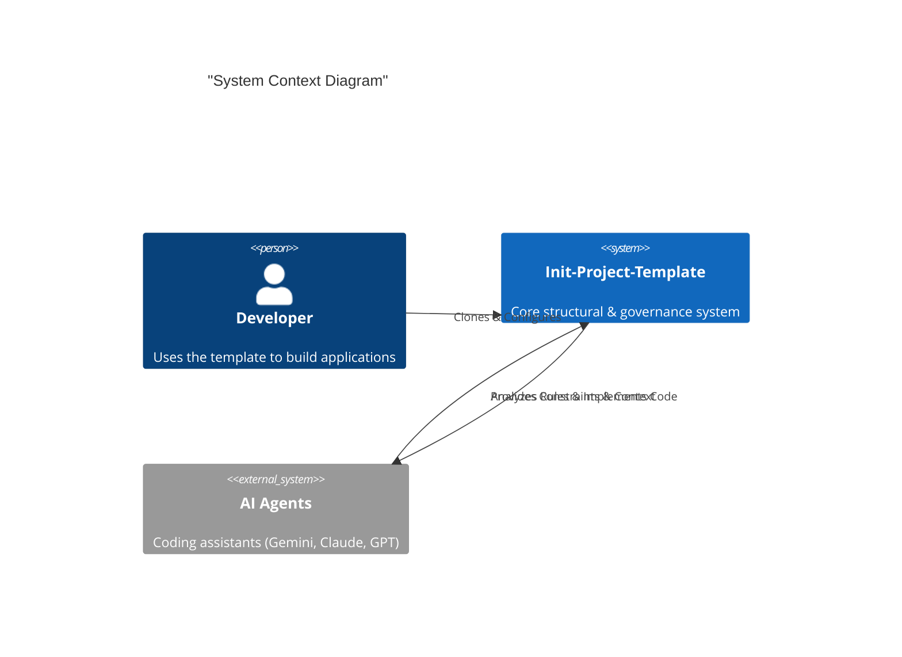

# Architecture Blueprint

This document serves as the project-level source of truth for high-level design,
structural principles, and technology stack alignment, as mandated by
`[REQ-ARC-01]`.

## 0. Architecture / Tech Stack Checklist (Project-Level)

> Use this checklist for **project-level** decisions.
>
> - **Pillar 1 (What)**: `docs/prd/` for business requirements.
> - **Pillar 2 (Vision)**: `ARCHITECTURE.md` (This file) for blueprint.
> - **Pillar 3 (Why)**: `docs/adr/` for major architectural decisions.
> - **Pillar 4 (How)**: `docs/ard/` for detailed implementation patterns.

| Item | Check Question | Required | Alignment Notes (Agreement) | Primary Document |
| --- | --- | --- | --- | --- |
| Architecture Style | Is the architecture style decided (Monolith/Modular Monolith/Microservices)? | Must |  | Section 1 |
| Service Boundaries | Are service/module boundaries and responsibilities documented (diagram/text)? | Must |  | Section 2 + Section 6 |
| Tech Stack (BE/FE) | Is the core tech stack decided (languages/frameworks/build tools)? | Must |  | Section 4 + `docs/core/08-tech-stack.md` |
| Database | Is the primary DB engine and schema strategy decided? | Must |  | `docs/core/08-tech-stack.md` + Specs |
| Infrastructure | Is cloud/on-prem, container/K8s, serverless decision made? | Must |  | Section 4 + `OPERATIONS.md` |
| NFR Targets | Are availability/latency/throughput targets defined as numbers? | Must |  | Specs + `OPERATIONS.md` |
| Architecture Principles | Is there a list of architecture principles incl. “don’ts”? | Optional |  | Section 5 |
| ADR, ARD, & PRD Process | Is there a process to record business requirements (PRD), major decisions (ADR), and living patterns (ARD)? | Optional |  | Section 5 + `docs/` |

## 1. Architecture Style

The project utilizes a **Modular Monolith** architecture as the default starting
point, allowing for clear service boundaries that can evolve into
**Microservices** if required.

## 2. System Context (C4 Model)

We utilize the C4 modeling pattern to visualize system boundaries. The template
functions as a bridge between the Developer's intent and the AI Agent's
execution.

## 3. Logical Layering

The architecture is organized into four distinct layers:

### 1. Agent Layer

- **Responsibility**: Autonomous execution, task management, and tool interaction.
- **Components**: `.agent/` directory (active rules, skills, workflows), `AGENTS.md`.

### 2. Governance Layer

- **Responsibility**: Encoding engineering standards, security protocols, and
  workflow rules.
- **Components**: `.agent/rules` (Master Knowledge Base), `templates/`.

### 3. Application Layer

- **Responsibility**: Core business logic, domain entities, and presentation.
- **Components**: `src/` (Domain-Driven Design).

### 4. Infrastructure Layer

- **Responsibility**: Environment management, CI/CD, and orchestration.
- **Components**: `scripts/`, `Makefile`, `Dockerfile`, `.github/`.

## 4. Technology Stack

Refer to `docs/core/08-tech-stack.md` for detailed choices.

- **Frontend**: Next.js / TypeScript
- **Backend**: Python / Node.js / Go
- **Database**: PostgreSQL / Valkey(Redis)
- **Infra**: Docker / GitHub Actions

## 5. Architecture Principles (Standards)

All components MUST adhere to the [Architecture Standard (0130)](./.agent/rules/0100-Standards/0130-architecture-standard.md):

1. **Rule-Governed Execution**: Actions are governed by coded rules (e.g., `[REQ-XXX-NN]`).
2. **Directional Dependency**: Presentation -> Domain -> Data.
3. **Zero Circularity**: Circular dependencies are strictly prohibited.
4. **Traceability**: Every major commit or PR references a technical specification.
5. **Doc Governance**: Feature requirements MUST be in `docs/prd/`, significant decisions in `docs/adr/`, and active patterns in `docs/ard/`.

## 6. Component Boundaries

Major system boundaries are defined as follows:

- **Core Domain**: Business logic and entities.
- **Application Services**: Use cases and orchestration.
- **Infrastructure**: Persistence, Messaging, and External APIs.

## 7. Domain Model (Reference)

The authoritative domain models (ER/UML) should live in feature/component Specs
(see `templates/spec-template.md` Section 3), with links back to this document
and/or ADRs as needed.
