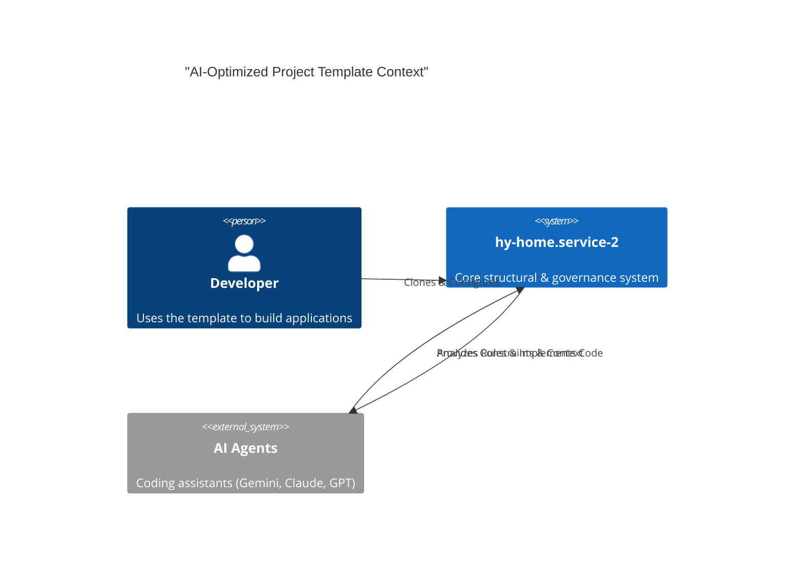

# System Architecture

This document serves as the project-level source of truth for high-level design, structural principles, and technology stack alignment.

## 1. System Context

We utilize the C4 modeling pattern to visualize system boundaries and interactions. The template functions as a bridge between the Developer's intent and the AI Agent's execution, governed by a set of strict, machine-readable rules.

```mermaid
C4Context
    title "AI-Optimized Project Template Context"
    
    Person(dev, "Developer", "Uses the template to build applications")
    System(template, "hy-home.service-2", "Core structural & governance system")
    System_Ext(agents, "AI Agents", "Coding assistants (Gemini, Claude, GPT)")
    
    Rel(dev, template, "Clones & Configures")
    Rel(agents, template, "Analyzes Rules & Implements Code")
    Rel(template, agents, "Provides Constraints & Context")
```

---

## 2. Logical Layering

The architecture is organized into four distinct layers, ensuring a clear separation of concerns between AI operations, project governance, and the actual application logic.

### 1. Agent Layer

- **Responsibility**: Autonomous execution, task management, and tool interaction.
- **Components**: `.agent/` directory, including active `rules`, `skills`, and `workflows`.
- **Persona Integration**: Defined in `AGENTS.md`.

### 2. Governance Layer

- **Responsibility**: Encoding engineering standards, security protocols, and workflow rules.
- **Components**: `.agent/rules` (Active Rules), `templates/`.
- **Standardization**: Uses 8-section rule skeletons for AI-parseability.

### 3. Application Layer

- **Responsibility**: Core business logic, domain entities, and presentation.
- **Components**: `src/` (to be created), `examples/`.
- **Pattern**: Adheres to Domain-Driven Design (DDD) principles where applicable.

### 4. Infrastructure Layer

- **Responsibility**: Environment management, CI/CD, and orchestration.
- **Components**: `scripts/`, `Makefile`, `Dockerfile`, `docker-compose.yml`, `.github/`.

---

## 3. Governance Model

The project operates under a **Multi-Pillar Governance** model. All modifications are validated against coded requirements `[REQ-XXX-NN]`.

| Pillar | Focus Area | Core Standard |
| --- | --- | --- |
| **0100: Standards** | Engineering Excellence | [0100-unified-master.md](.agent/rules/0100-Standards/0100-unified-master.md) |
| **0200: Workflows** | SDLC & Git Operations | [0200-workflow-standard.md](.agent/rules/0200-Workflows/0200-workflow-standard.md) |
| **0500: Security** | Vulnerability Management | [2200-security-pillar.md](.agent/rules/2200-Security/2200-security-pillar.md) |
| **1000: Tech Stack** | Framework & Typing | [0150-tech-stack-standard.md](.agent/rules/0100-Standards/0150-tech-stack-standard.md) |

---

## 4. Structural Standards

All components MUST adhere to the [Architecture Standard (0130)](.agent/rules/0100-Standards/0130-architecture-standard.md):

- **Directional Dependency**: Presentation -> Domain -> Data.
- **Zero Circularity**: Circular dependencies are strictly prohibited.
- **ADR Governance**: Significant design decisions MUST be recorded in `docs/adr/`.
- **Traceability**: Every major commit or PR should reference a technical specification from `specs/`.

---

## 5. Technology Stack

| Category | Standard | Alignment |
| --- | --- | --- |
| **Environment** | Docker / Node.js / Python | Multi-language support |
| **Orchestration** | Universal Scripts / Make | OS-agnostic execution |
| **Governance** | Markdown-based Rules | Human/Machine parseable |
| **Verification** | NPM Scripts / Pytest | Automated QA protocols |
