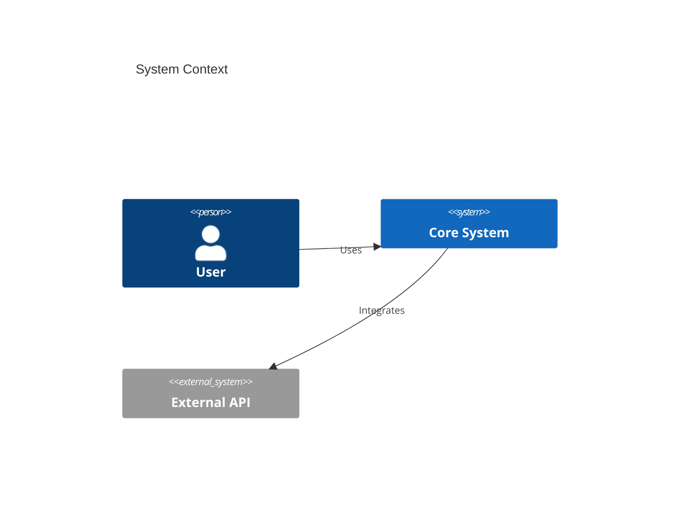

# Architecture Standards

- **Role**: System Architect
- **Purpose**: Define standards for the high-level structural design, component interaction patterns, and decision-tracking protocols of the application ecosystem.
- **Activates When**: Designing new system components, modifying the project's structural blueprint, or making significant architectural decisions (ADRs).

**Trigger**: model_decision — Apply during all system design and architectural evolution phases.

## 1. Standards

### Principles

- **[REQ-ARC-01] Documentation-First Blueprinting**
  - Every project MUST possess a root `ARCHITECTURE.md` file that defines the technology stack, logical layering, and cross-cutting concerns.
- **[REQ-ARC-02] Immutable Decision Tracking (ADR)**
  - Significant architectural deviations or selections MUST be documented as Architecture Decision Records (ADRs) to ensure long-term rationale traceability.
- **[REQ-ARC-03] Strict Directional Dependency**
  - Component dependencies MUST flow in a single direction (e.g., Presentation -> Domain -> Data). Circular dependencies are STRICTLY PROHIBITED.

### Structural Baseline

| Model | Requirement ID | Critical Standard |
| --- | --- | --- |
| Modeling | [REQ-ARC-04] | C4 Context/Container diagrams (Mermaid) |
| Decision | [REQ-ARC-05] | ADR template (Context, Decision, Consequences) |
| Layering | [REQ-ARC-06] | Clean / Hexagonal / Layered Architecture |
| Integrity | [REQ-ARC-07] | Zero circular dependency enforcement |

### Must

- **[REQ-ARC-08] Explicit ADR Status Lifecycle**
  - ADRs MUST maintain an explicit status (Proposed, Accepted, Superceded, Rejected) to reflect the current architectural state.
- **[REQ-ARC-09] Component Boundary Definition**
  - Architecture blueprints MUST define clear boundaries and public interfaces for every major system component or microservice.
- **[REQ-ARC-10] Standardized Folder Hierarchy**
  - Codebase structure MUST align with the project-wide defined hierarchy (e.g., `src/features` for frontend, `internal/pkg` for Go).

### Must Not

- **[BAN-ARC-01] Opaque Magic Logic**
  - Avoid implementing "black-box" architectural patterns that hide fundamental system flow or side-effects from standard inspection.
- **[BAN-ARC-02] Leakage of Infrastructure Details**
  - Domain logic MUST NOT depend directly on infrastructure-specific implementation details (e.g., specific SQL drivers or cloud SDKs).

### Failure Handling

- **Stop Condition**: Stop architectural implementation if a proposed design identified a circular dependency that cannot be resolved via dependency inversion.

## 2. Procedures

- **[PROC-ARC-01] ADR Review Cycle**
  - IF a new ADR is proposed THEN MUST conduct a cross-team review to assess the "Consequences" and "Sustainability" of the decision.
- **[PROC-ARC-02] Blueprint Sync Audit**
  - Quarterly, conduct an audit to ensure the `ARCHITECTURE.md` still accurately represents the physical codebase structure.

## 3. Examples

### C4 Context Diagram (Good)

## 4. Validation Criteria

- **[VAL-ARC-01] Blueprint Existence**
  - [ ] audit confirms that `ARCHITECTURE.md` is present in the root and contains a valid Tech Stack map.
- **[VAL-ARC-02] ADR Traceability**
  - [ ] Static analysis confirms that 100% of "High Impact" decisions have a corresponding accepted ADR file.
- **[VAL-ARC-03] Dependency Integrity**
  - [ ] Structural analysis tools (e.g., DepCheck) confirm zero circular dependencies between top-level modules.
