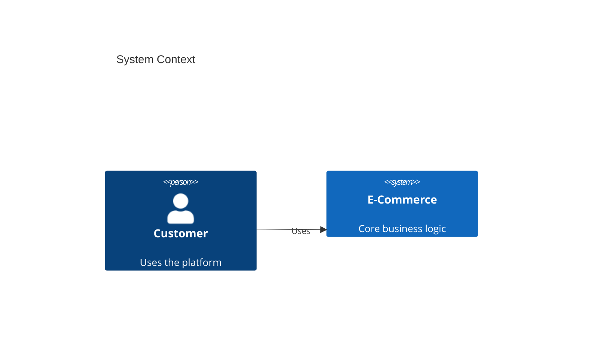

# Architecture Documentation Standards

- **Role**: Architecture Solutions Lead
- **Purpose**: Define standards for maintaining a clear, accurate, and evolvable source of truth for the system's design, decision history, and product requirements.
- **Activates When**: Updating `ARCHITECTURE.md`, creating ADRs, PRDs, ARDs, or designing system visualization diagrams.

**Trigger**: model_decision — Apply during the creation and evolution of system architecture documentation.

## 1. Standards

### Principles

- **[REQ-ADR-01] Immutable Decision History (ADR)**
  - Architecture decisions MUST be documented as ADRs using a standardized template to ensure historical traceability.
- **[REQ-ADR-02] Blueprint Fidelity (ARCHITECTURE.md)**
  - The `ARCHITECTURE.md` file MUST be maintained as the primary high-level technical map, including stack and layer boundaries.
- **[REQ-PRD-01] Problem-First Requirements (PRD)**
  - Product features MUST be defined in PRDs focusing on vision, metrics, and personas before implementation.
- **[REQ-ARD-01] Living Technical Reference (ARD)**
  - Detailed implementation patterns and component designs MUST be documented in ARDs and kept up-to-date with the code.
- **[REQ-ARC-03] Intentional Visualization**
  - Architecture diagrams MUST prioritize clarity using the C4 model where applicable.

### Documentation Hierarchy

| Artifact | Requirement ID | Purpose |
| --- | --- | --- |
| ARCHITECTURE.md | [REQ-ADR-04] | Master Blueprint & Technical Map |
| ADR (docs/adr/) | [REQ-ADR-05] | Historical "Why" (Immutable Decisions) |
| PRD (docs/prd/) | [REQ-PRD-02] | Business "What" (Stakeholder Alignment) |
| ARD (docs/ard/) | [REQ-ARD-02] | Technical "How" (Living Reference) |
| C4 Diagrams | [REQ-ADR-07] | Visual context & component mapping |

### Must

- **[REQ-ADR-08] Template Compliance**
  - Every ADR, PRD, and ARD MUST use its respective authoritative template from the `templates/` directory.
- **[REQ-ARD-04] ARD Core Sections**
  - Every ARD MUST include: Executive Summary, System Overview (C4 Context), Component Architecture (C4 Container), Data Architecture, Security, NFRs, and Trade-offs.
- **[REQ-PRD-03] Stakeholder Review**
  - PRDs MUST reach "Approved" status before technical implementation commences.
- **[REQ-PRD-04] PRD Quality Standards**
  - Every PRD MUST include: Quantitative Metrics (targets & baseline), Persona-based pain points/goals, and Acceptance Criteria in Given-When-Then format.
- **[REQ-ARD-03] Technical Accuracy**
  - ARDs MUST reflect the actual implementation in the current codebase.
- **[REQ-ADR-10] Visual Consistency**
  - Diagrams MUST use Mermaid JS syntax and maintain consistent color coding for system boundaries.

### Must Not

- **[BAN-ADR-01] Silent Architectural Shifts**
  - Significant changes to system boundaries or technology choices MUST NOT occur without a corresponding ADR.
- **[BAN-ADR-02] Stale Blueprint**
  - The `ARCHITECTURE.md` MUST NOT be left in a state where it describes a defunct or heavily modified architectural pattern.

### Failure Handling

- **Stop Condition**: Stop documentation updates if an ADR is identified that lacks a "Consequences" or "Alternatives Considered" section.

## 2. Procedures

- **[PROC-ADR-01] ADR Sequential Tracking**
  - IF creating a new ADR THEN MUST assign the next sequential ID in the format `adr-NNNN-[slug].md`.
- **[PROC-ADR-02] Blueprint Sync Audit**
  - Perform a monthly audit of `ARCHITECTURE.md` against the current folder structure and dependency graph.

## 3. Examples

### Mermaid C4Context (Good)

## 4. Validation Criteria

- **[VAL-ADR-01] Decision Traceability**
  - [ ] Every major technology switch (e.g., DB change) is mapped to an "Accepted" ADR.
- **[VAL-ADR-02] Template Compliance**
  - [ ] 100% of files in `docs/adr/` follow the mandatory structural sections.
- **[VAL-ADR-03] Visual Accuracy**
  - [ ] Manual review confirms that Mermaid diagrams correctly reflect current service-to-service communication paths.
