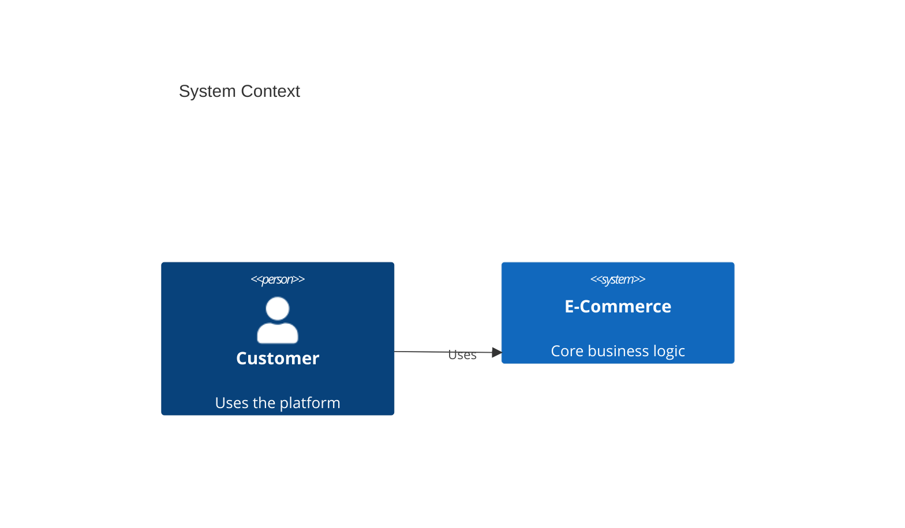

# Architecture Documentation Standards

- **Role**: Architecture Solutions Lead
- **Purpose**: Define standards for maintaining a clear, accurate, and evolvable source of truth for the system's design and decision history.
- **Activates When**: Updating `ARCHITECTURE.md`, creating Architecture Decision Records (ADRs), or designing system visualization diagrams.

**Trigger**: model_decision — Apply during the creation and evolution of system architecture documentation.

## 1. Standards

### Principles

- **[REQ-ADR-01] Immutable Decision History**
  - Architecture decisions MUST be documented as Architecture Decision Records (ADRs) using a standardized template to ensure historical traceablity.
- **[REQ-ADR-02] Blueprint Fidelity**
  - The `ARCHITECTURE.md` file MUST be maintained as the primary high-level technical map of the project, including stack definitions and layer boundaries.
- **[REQ-ADR-03] Intentional Visualization**
  - Architecture diagrams MUST prioritize clarity of responsibility and interaction over low-level implementation details, utilizing the C4 model where applicable.

### Documentation Hierarchy

| Artifact | Requirement ID | Purpose |
| --- | --- | --- |
| ARCHITECTURE.md | [REQ-ADR-04] | Master Blueprint & Technical Map |
| ADR (docs/adr/) | [REQ-ADR-05] | Significant decision history |
| Folder Map | [REQ-ADR-06] | Structural discoverability guide |
| C4 Diagrams | [REQ-ADR-07] | Visual context & component mapping |

### Must

- **[REQ-ADR-08] Standard ADR Template**
  - Every ADR MUST include Status (Proposed/Accepted/Superseded), Context, Decision, Consequences, and Alternatives Considered.
- **[REQ-ADR-09] Explicit Component Responsibility**
  - Every major architectural component documented MUST have a clearly defined "Purpose" and "Interaction Boundary".
- **[REQ-ADR-10] Visual Consistency**
  - Diagrams MUST use Mermaid JS syntax for integration within markdown and maintain consistent color coding for system boundaries.

### Must Not

- **[BAN-ADR-01] Silent Architectural Shifts**
  - Significant changes to system boundaries or technology choices MUST NOT occur without a corresponding ADR.
- **[BAN-ADR-02] Stale Blueprint**
  - The `ARCHITECTURE.md` MUST NOT be left in a state where it describes a defunct or heavily modified architectural pattern.

### Failure Handling

- **Stop Condition**: Stop documentation updates if an ADR is identified that lacks a "Consequences" or "Alternatives Considered" section.

## 2. Procedures

- **[PROC-ADR-01] ADR Sequential Tracking**
  - IF creating a new ADR THEN MUST assign the next sequential ID in the format `adr-NNNN-[slug].md`.
- **[PROC-ADR-02] Blueprint Sync Audit**
  - Perform a monthly audit of `ARCHITECTURE.md` against the current folder structure and dependency graph.

## 3. Examples

### Mermaid C4Context (Good)

```mermaid
C4Context
    title System Context
    Person(customer, "Customer", "Uses the platform")
    System(ecommerce, "E-Commerce", "Core business logic")
    Rel(customer, ecommerce, "Uses")
```

## 4. Validation Criteria

- **[VAL-ADR-01] Decision Traceability**
  - [ ] Every major technology switch (e.g., DB change) is mapped to an "Accepted" ADR.
- **[VAL-ADR-02] Template Compliance**
  - [ ] 100% of files in `docs/adr/` follow the mandatory structural sections.
- **[VAL-ADR-03] Visual Accuracy**
  - [ ] Manual review confirms that Mermaid diagrams correctly reflect current service-to-service communication paths.
