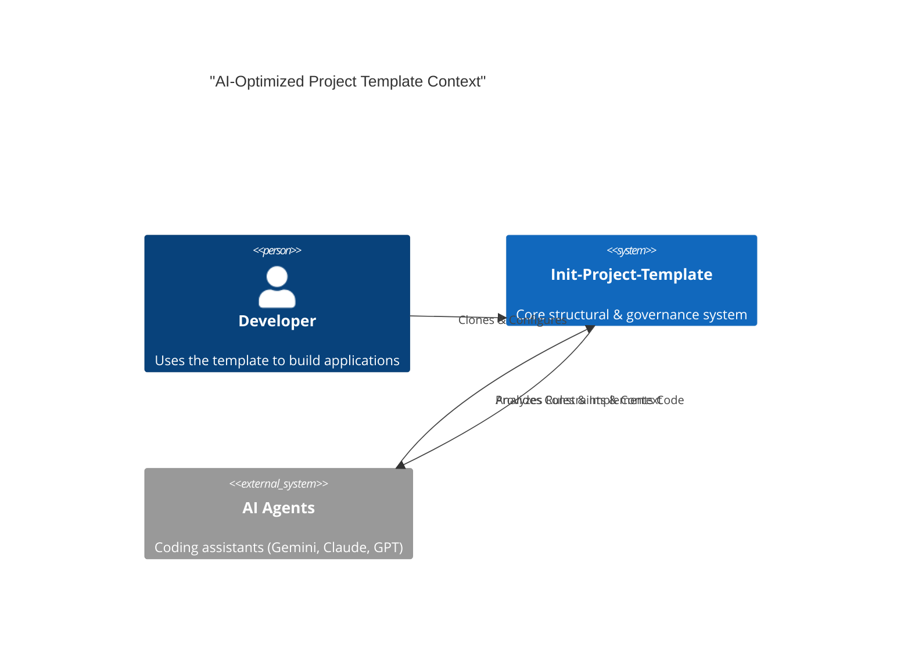

# System Architecture

This document serves as the project-level source of truth for high-level design, structural principles, and technology stack alignment.

## 1. System Context (C4 Model)

We utilize the C4 modeling pattern to visualize system boundaries. The template functions as a bridge between the Developer's intent and the AI Agent's execution.

## 2. Logical Layering

The architecture is organized into four distinct layers:

### 1. Agent Layer

* **Responsibility**: Autonomous execution, task management, and tool interaction.
* **Components**: `.agent/` directory (active rules, skills, workflows), `AGENTS.md`.

### 2. Governance Layer

* **Responsibility**: Encoding engineering standards, security protocols, and workflow rules.
* **Components**: `agent_settings/rules` (Master Knowledge Base), `templates/`.
* **Standardization**: Uses 8-section rule skeletons for AI-parseability.

### 3. Application Layer

* **Responsibility**: Core business logic, domain entities, and presentation.
* **Components**: `src/` (to be created), `examples/`.
* **Pattern**: Adheres to Domain-Driven Design (DDD) principles.

### 4. Infrastructure Layer

* **Responsibility**: Environment management, CI/CD, and orchestration.
* **Components**: `scripts/`, `Makefile`, `Dockerfile`, `docker-compose.yml`, `.github/`.

## 3. Structural Standards

All components MUST adhere to the [Architecture Standard (0130)](../../.agent/rules/0100-Standards/0130-architecture-standard.md):

* **Directional Dependency**: Presentation -> Domain -> Data.
* **Zero Circularity**: Circular dependencies are strictly prohibited.
* **ADR Governance**: Significant design decisions MUST be recorded in `docs/adr/`.
* **Traceability**: Every major commit or PR should reference a technical specification.
