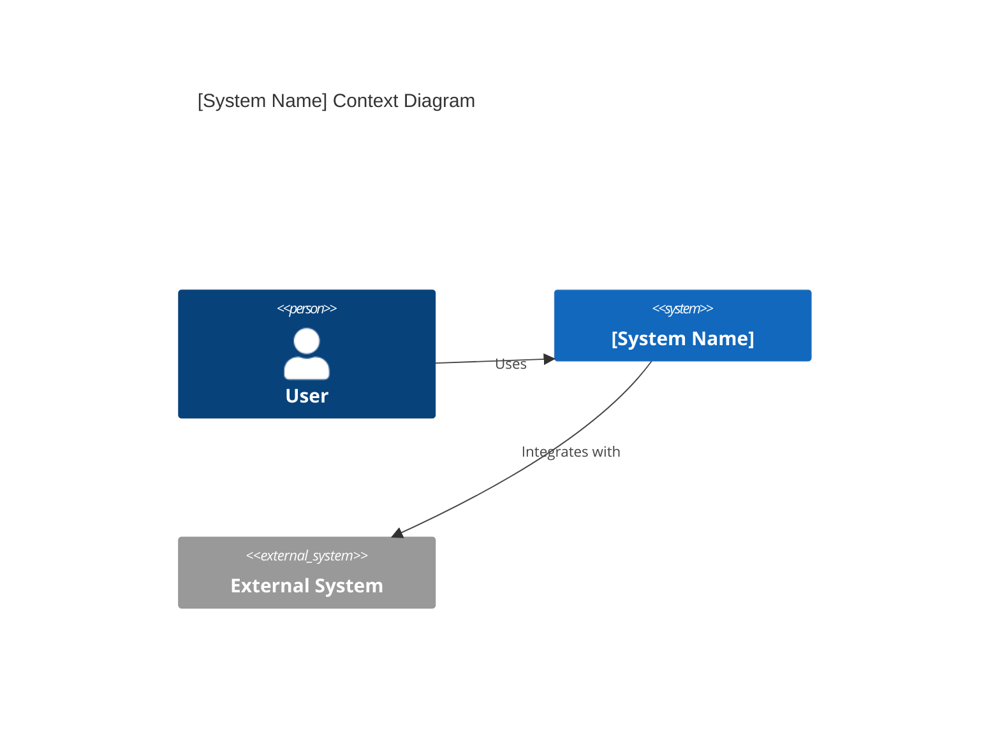
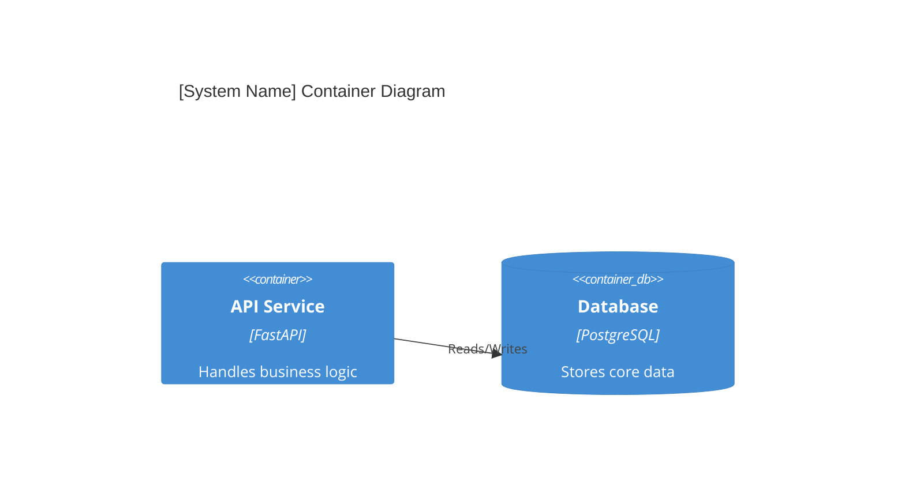

# [System/Service Name] Architecture Reference Document (ARD)

- **Status**: [Draft | Review | Approved]
- **Owner**: [Name]
- **ADR References**: [Link to ADRs]
- **PRD Reference**: [Link to PRD]

---

## 1. Executive Summary

[Provide a high-level overview of the system/service, its purpose, and the problem it solves. This section is targeted at stakeholders and architects.]

## 2. System Overview & Context

[Describe how this system fits into the larger ecosystem. Use a C4 Context diagram to show external dependencies and users.]

## 3. Component Architecture

[Detail the internal structure of the system. Modular boundaries, key services, and interaction patterns.]

## 4. Data Architecture

- **Domain Model**: [Describe core entities and their relationships]
- **Storage Strategy**: [Rationale for chosen DBs, caching, and persistence]
- **Data Flow**: [How data moves through the system, especially async flows]

## 5. Security & Compliance

- **Authentication/Authorization**: [Brief overview, link to details in Spec]
- **Data Protection**: [Encryption, PII handling]
- **Audit Logging**: [Key events captured for compliance]

## 6. Non-Functional Requirements (NFRs)

- **Scalability**: [Horizontal/Vertical scaling plans]
- **Availability**: [Uptime goals, fallback strategies]
- **Performance**: [Latency/Throughput targets]

## 7. Deployment & Infrastructure

- **Environment**: [On-prem, Cloud, Hybrid]
- **Orchestration**: [Docker, K8s, etc.]
- **CI/CD Pipeline**: [Brief overview of the deployment flow]

## 8. Alternatives & Trade-offs

- **Considered Alternatives**: [What other paths were explored?]
- **Chosen Path Rationale**: [Why this design over others?]
- **Known Limitations**: [What are the current trade-offs?]

---

> [!TIP]
> This ARD should avoid code-level details. For specific implementation logic, use the **Technical Specification** template.
