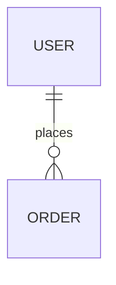

# [Component Name] Technical Specification

- **Status**: Draft / Implementation / Validated
- **PRD Reference**: [Link to PRD]
- **Architecture Reference**: [Link to ARCHITECTURE.md](../../ARCHITECTURE.md)

---

## 0. Architecture / Tech Stack Checklist (Fill Before Implementation)

> This Spec is the source of truth for architecture/stack decisions at the
> feature/component level. Use `ARCHITECTURE.md` for project-level decisions
> and record major choices in `docs/adr/`.

| Item | Check Question | Required | Alignment Notes | Where to document |
| --- | --- | --- | --- | --- |
| Architecture Style | Is the style Monolith/Modular Monolith/Microservices? | Must | | Section 1 |
| Service Boundaries | Are module boundaries documented (diagram/text)? | Must | | Section 1 |
| Domain Model | Are core domain entities and relationships defined? | Must | | Section 3 |
| Backend Stack | Are language/framework/libs (web, ORM, auth) decided? | Must | | Section 1 |
| Frontend Stack | Are framework/state/build tools decided? | Must | | Section 1 |
| Database | Is primary DB engine and schema strategy decided? | Must | | Section 3 |
| Messaging / Async | Is message broker or async approach defined? | Optional | | Section 4 |
| Infrastructure | Is cloud, container/K8s, serverless decision made? | Must | | Section 6 |
| NFRs | Are availability/latency/throughput goals defined? | Must | | Section 5 |
| Scalability | Is scale-up/out, partitioning strategy drafted? | Optional | | Section 6 |
| Principles | Is there a list of principles including "don'ts"? | Optional | | ARCHITECTURE.md |
| ADR Process | Is there a process to record decisions as ADRs? | Optional | | Section 8 |

## 0. Quality / Testing / Security Checklist (Fill Before Implementation)

> This Spec is the source of truth for feature-level quality/testing/security
> decisions. Project-level guidance lives in `docs/manuals/09-security-qa.md`
> and the governance rules under `.agent/rules/`.

| Item | Check Question | Required | Alignment Notes | Where to document |
| --- | --- | --- | --- | --- |
| Test Strategy | Levels (Unit/Integration/E2E/Load) defined? | Must | | Section 7 |
| Test Tooling | Agreed framework/runner and mock strategy? | Must | | Section 7 |
| Coverage Policy | Are goals defined as numbers (e.g. 100%)? | Must | | Section 7 |
| Coverage Gate | Do we fail CI/PR when coverage is below threshold? | Must | | CI config |
| Static Analysis | Are linter rules and auto-fix tools defined? | Must | | .pre-commit-config.yaml |
| Style Guide | Are naming/structure conventions documented? | Optional | | .agent/rules/ |
| Complexity | Is a complexity threshold agreed (e.g. <= 10)? | Optional | | .pre-commit-config.yaml |
| Security | Baseline checks defined (secrets, deps, SAST)? | Must | | .pre-commit-config.yaml |
| AuthN/AuthZ | Is auth approach designed (token/OAuth/RBAC)? | Must | | Section 4/8 |
| Data Protection | Encryption/access policies for sensitive data? | Must | | Section 9 |
| Security Review | Security review step for high-risk features? | Optional | | Section 8 |

## 0. Operations / Deployment / Monitoring Checklist (Fill Before Implementation)

> This Spec must declare feature-level operational requirements and align with
> `OPERATIONS.md` and the Observability Pillar.

| Item | Check Question | Required | Alignment Notes | Where to document |
| --- | --- | --- | --- | --- |
| Environments | Are tier (dev/staging/prod) clarify for feature? | Must | | OPERATIONS.md |
| Deployment | Strategy selected (manual vs CI/CD; rolling)? | Must | | Section 9 |
| Approval | Is production approval/gate defined (who, criteria)? | Must | | Section 9 |
| Config/Secrets | Are env vars and secret management decided? | Must | | Section 9 |
| Logging | Required structured logs defined (fields, IDs)? | Must | | Section 9 |
| Monitoring | Metrics and dashboards defined (RED/USE)? | Must | | Section 9 |
| Alerts | Are alert thresholds and routing defined? | Must | | Section 9 |
| IR | Is incident response/runbook linkage defined? | Optional | | Section 9 |
| Backups | Are backup policies defined for added data? | Must | | Section 9 |
| Continuity | Are RTO/RPO targets specified for continuity? | Optional | | Section 9 |
| Cost | Are cost tagging/alerts defined if adding infra? | Optional | | Section 9 |

## 1. Technical Overview & Architecture Style

High-level implementation strategy and chosen architecture style.

### Boundaries & Responsibilities

- **Component Boundary**: [What this component owns and handles]
- **Key Dependencies**: [List significant upstream/downstream deps]

### Tech Stack (Feature-Level)

- **Backend**: [Language / framework / key libs (web, ORM, auth)]
- **Frontend**: [Framework / state mgmt / build tool]

## 2. Coded Requirements (Traceability)

| ID | Requirement Description | Priority | Parent PRD REQ |
| --- | --- | --- | --- |
| **[REQ-SPC-001]** | [Functional logic] | High | REQ-PRD-FUN-01 |
| **[SEC-SPC-001]** | [Security constraint] | Critical | N/A |

## 3. Data Modeling & Storage Strategy

- **Database Engine**: [e.g., PostgreSQL, Redis]
- **Schema Strategy**: [e.g., Relation, Document structure]
- **Migration Plan**: [How to handle data migrations]



## 4. Interface Definitions

### API Endpoints

- `POST /v1/[resource]`
- `GET /v1/[resource]/{id}`

### Schemas (Zod/Pydantic)

```typescript
const MySchema = z.object({ ... });
```

### AuthN / AuthZ (Required if protected data/actions)

- **Authentication**: [Session cookie | JWT | OAuth/OIDC | API key]
- **Authorization**: [RBAC/ABAC ownership checks, permission model]
- **Token Policy**: [TTL, refresh, revocation, logout]
- **Sensitive Endpoints**: [List endpoints requiring strict access]

### Async / Messaging (Optional)

- **Approach**: [None | In-process queue | Background worker | Kafka | RabbitMQ]
- **Topics/Queues**: [List]
- **DLQ Strategy**: [Retry / DLQ Policy]
- **Idempotency Strategy**: [Policy]

## 5. Non-Functional Requirements (NFR)

- **Performance**: [e.g., Response time < 200ms for 95th percentile]
- **Throughput**: [e.g., Support 1000 requests per second]
- **Availability**: [e.g., 99.9% uptime for core services]
- **Security**: [e.g., SOC2 compliance, Encryption at rest]

## 6. Scalability & Infrastructure

- **Caching Strategy**: [e.g., Redis for session data, CDN for static]
- **Scaling Strategy**: [e.g., Horizontal pod autoscaling]
- **Infrastructure**: [e.g., Memory/CPU limits per pod]

## 7. Verification Plan

- **[VAL-SPC-001]** Unit Test: [Description]
- **[VAL-SPC-002]** Integration Test: [Description]
- **[VAL-SPC-003]** Coverage: [Target numbers + how measured]
- **[VAL-SPC-004]** E2E (Optional): [If applicable] (If not applicable, write `N/A (reason: ...)`.)
- **[VAL-SPC-005]** Load (Optional): [If applicable] (If not applicable, write `N/A (reason: ...)`.)

## 8. ADRs & Decision Log (Optional)

- **New ADRs Required?**: [Yes/No]
- **Related ADRs**:
  - `docs/adr/0001-...`

## 9. Operations & Observability

- **Deployment Strategy**: [e.g., Rolling update, Blue-Green, Canary]
- **Monitoring & Alerts**: [Specify key metrics and alert thresholds]
- **Logging**: [Specific structured logs required for this feature]
- **Data Protection**: [Backup schedule and RPO/RTO goals]
- **Sensitive Data Handling**: [PII/Secrets, encryption, controls]

## 10. Implementation Lifecycle

1. [Step 1]
2. [Step 2]
3. [Step 3]
