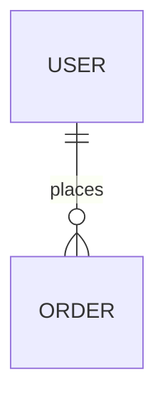

# [Component Name] Technical Specification

- **Status**: Draft / Implementation / Validated
- **PRD Reference**: [Link to PRD]
- **Architecture Reference**: [Link to ARCHITECTURE.md]

---

## 1. Technical Overview

High-level implementation strategy and technological choices.

## 2. Coded Requirements (Traceability)

| ID | Requirement Description | Priority | Parent PRD REQ |
| --- | --- | --- | --- |
| **[REQ-SPC-001]** | [Functional logic] | High | REQ-PRD-FUN-01 |
| **[SEC-SPC-001]** | [Security constraint] | Critical | N/A |

## 3. Data Modeling


```mermaid
erDiagram
    USER ||--o{ ORDER : places
```

## 4. Interface Definitions

### API Endpoints

- `POST /v1/[resource]`
- `GET /v1/[resource]/{id}`

### Schemas (Zod/Pydantic)

```typescript
const MySchema = z.object({ ... });
```

## 5. Verification Plan

- **[VAL-SPC-001]** Unit Test: [Description]
- **[VAL-SPC-002]** Integration Test: [Description]

## 6. Implementation Lifecycle

1. [Step 1]
2. [Step 2]
3. [Step 3]
